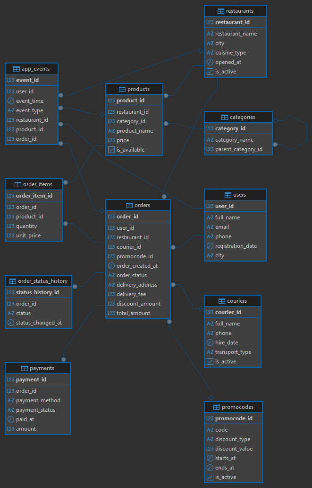

# Food Delivery SQL Analytics

Проект по проектированию базы данных и аналитике сервиса доставки еды с использованием PostgreSQL.

В рамках проекта я самостоятельно спроектировал структуру реляционной базы данных, настроил связи между таблицами, сгенерировал связанные тестовые данные и написал аналитические SQL-запросы для расчёта продуктовых и операционных метрик.

## Стек

- PostgreSQL
- SQL
- DBeaver

## Данные

В проекте используется синтетический набор данных, имитирующий работу сервиса доставки еды.

Структура базы данных спроектирована на основе типичных процессов такого сервиса:

- регистрация пользователей;
- просмотр ресторанов и товаров;
- добавление товаров в корзину;
- оформление заказа;
- применение промокода;
- оплата заказа;
- назначение курьера;
- приготовление и доставка;
- отмена заказа.

Внешний датасет не использовался. Тестовые данные сгенерированы средствами PostgreSQL с использованием `generate_series()` и `random()`.

Для воспроизводимости генерации используется `setseed(0.42)`, поэтому повторный запуск скрипта создаёт одинаковую последовательность случайных значений.

При генерации учитываются следующие ограничения:

- заказ не может быть создан раньше регистрации пользователя;
- пользователь выбирает ресторан из своего города;
- промокод применяется только во время срока его действия;
- позиции заказа относятся к выбранному ресторану;
- повторный заказ создаётся после первого заказа пользователя;
- время доставки зависит от типа транспорта курьера;
- в событиях присутствуют сессии, которые завершились без создания заказа.

Все пользователи, адреса, заказы, платежи и события являются вымышленными и не содержат реальных персональных данных.

В проекте под выручкой понимается сумма `total_amount` по доставленным заказам. Она включает стоимость товаров и доставки за вычетом применённой скидки.

## Структура базы данных

База данных содержит следующие таблицы:

- `users` — пользователи сервиса;
- `restaurants` — рестораны;
- `couriers` — курьеры;
- `categories` — категории товаров;
- `products` — товары и блюда;
- `orders` — заказы;
- `order_items` — позиции заказов;
- `payments` — платежи;
- `promocodes` — промокоды;
- `order_status_history` — история изменения статусов заказов;
- `app_events` — события пользователей в приложении.

Между таблицами настроены первичные и внешние ключи. Также добавлены ограничения `NOT NULL`, `UNIQUE`, `CHECK` и значения по умолчанию.

## ER-диаграмма



## Что реализовано

В проекте реализованы:

- концептуальная, логическая и физическая модели базы данных;
- создание схемы и таблиц;
- первичные и внешние ключи;
- ограничения целостности данных;
- воспроизводимая генерация связанных тестовых данных;
- проверки логической согласованности данных;
- история изменения статусов заказов;
- события пользователей в приложении;
- представления для анализа заказов и ежедневных метрик;
- индексы для часто используемых полей;
- аналитические SQL-запросы.

## Аналитические задачи

В проекте рассчитаны следующие показатели:

1. Количество заказов и покупателей по месяцам.
2. Выручка и средний чек по доставленным заказам.
3. Изменение выручки относительно предыдущего месяца.
4. Топ-3 ресторанов по выручке в каждом месяце.
5. Доля отменённых заказов по ресторанам.
6. Среднее и медианное время доставки.
7. Эффективность курьеров.
8. Сравнение заказов с промокодом и без него.
9. Доля пользователей с повторными заказами.
10. Когортный retention пользователей.
11. RFM-сегментация покупателей.
12. Иерархия категорий через рекурсивный CTE.
13. Воронка пользовательских событий от открытия приложения до создания заказа.

## Использованные возможности SQL

В аналитических запросах используются:

- `JOIN`;
- подзапросы;
- CTE;
- рекурсивный CTE;
- оконные функции;
- `LAG`;
- `DENSE_RANK`;
- `NTILE`;
- `CASE`;
- `FILTER`;
- `COALESCE`;
- `NULLIF`;
- `date_trunc`;
- `percentile_cont`;
- агрегатные функции;
- представления;
- индексы.

## Представления

В проекте созданы два представления.

### `v_order_summary`

Содержит подробную информацию о каждом заказе:

- пользователь;
- ресторан;
- курьер;
- промокод;
- количество товаров;
- стоимость товаров;
- размер скидки;
- итоговая сумма;
- способ и статус оплаты;
- время доставки.

### `v_daily_metrics`

Содержит агрегированные метрики по дням:

- количество доставленных заказов;
- количество уникальных покупателей;
- стоимость проданных товаров;
- выручка по доставленным заказам;
- средний чек;
- среднее время доставки.

## Структура проекта

```text
food-delivery-sql-analytics/
├── sql/
│   ├── 01_create_schema.sql
│   ├── 02_insert_data.sql
│   ├── 03_create_views.sql
│   ├── 04_analytical_queries.sql
│   └── 05_indexes.sql
├── docs/
│   ├── conceptual_model.md
│   ├── logical_model.md
│   └── physical_model.md
├── images/
│   └── erd.png
├── README.md
└── .gitignore
```

## Запуск проекта

Для запуска проекта необходимо установить PostgreSQL и программу для работы с базой данных, например DBeaver.

SQL-скрипты необходимо выполнить в следующем порядке:

```text
01_create_schema.sql
02_insert_data.sql
03_create_views.sql
05_indexes.sql
```

Файл `01_create_schema.sql` создаёт схему и таблицы.

Файл `02_insert_data.sql` очищает таблицы и генерирует новый набор тестовых данных.

Файл `03_create_views.sql` создаёт представления для дальнейшего анализа.

Файл `05_indexes.sql` добавляет индексы для основных полей.

Запросы из файла `04_analytical_queries.sql` рекомендуется запускать отдельно, так как каждый запрос решает самостоятельную аналитическую задачу.

> **Важно:** `01_create_schema.sql` удаляет существующую схему `food_delivery` вместе с её объектами, а `02_insert_data.sql` очищает таблицы перед повторной генерацией данных.

## Документация

- [Концептуальная модель](docs/conceptual_model.md)
- [Логическая модель](docs/logical_model.md)
- [Физическая модель](docs/physical_model.md)
- [Создание базы данных](sql/01_create_schema.sql)
- [Генерация данных](sql/02_insert_data.sql)
- [Создание представлений](sql/03_create_views.sql)
- [Аналитические запросы](sql/04_analytical_queries.sql)
- [Создание индексов](sql/05_indexes.sql)

## Основные результаты анализа

### Влияние промокодов

| Группа | Все заказы | Доставленные заказы | Средний чек доставленного заказа | Выручка | Доля отмен |
|---|---:|---:|---:|---:|---:|
| С промокодом | 1 074 | 990 | 4 593,11 | 4 547 182,38 | 7,82% |
| Без промокода | 1 926 | 1 770 | 4 915,23 | 8 699 954,70 | 8,10% |

В рамках сгенерированного набора данных средний чек доставленного заказа с промокодом составил 4 593,11, а без промокода — 4 915,23.

Средний чек заказов с промокодом оказался ниже на 322,12, или примерно на 6,55%.

Доля отмен среди заказов с промокодом составила 7,82%, а без промокода — 8,10%. Разница составила 0,28 процентного пункта.

Более высокая выручка группы без промокода связана как с большим количеством доставленных заказов, так и с более высоким средним чеком.

По наблюдаемым данным нельзя определить причинный эффект промокодов. Для этого потребовался бы контролируемый эксперимент или сравнение сопоставимых групп пользователей.

### Повторные покупки

Из 332 пользователей, получивших хотя бы один доставленный заказ, 180 совершили повторную покупку.

Доля повторных покупателей составила 54,22%.

Таким образом, больше половины покупателей вернулись и сделали как минимум второй заказ.

Показатель рассчитан только по доставленным заказам: пользователи, чей единственный заказ был отменён, не учитывались как покупатели.

### Воронка по событиям

| Этап | Количество событий | Конверсия с предыдущего этапа |
|---|---:|---:|
| Открытие приложения | 7 000 | — |
| Просмотр ресторана | 6 021 | 86,01% |
| Просмотр товара | 5 216 | 86,63% |
| Добавление в корзину | 4 396 | 84,28% |
| Начало оформления | 3 722 | 84,67% |
| Создание заказа | 3 000 | 80,60% |

Общая конверсия из открытия приложения в создание заказа составила 42,86%.

Наибольшая относительная потеря наблюдается на последнем этапе: количество событий `order_created` составляет 80,60% от количества событий `checkout_start`.

В абсолютном выражении наибольшая потеря происходит между открытием приложения и просмотром ресторана — разница составляет 979 событий.

Потери на этапе оформления могут быть связаны со стоимостью доставки, изменением итоговой суммы, отсутствием подходящего способа оплаты или отказом пользователя от покупки.

Для проверки этих гипотез потребовались бы дополнительные данные о действиях и ошибках во время оформления.

Воронка рассчитана по количеству событий. Для полноценного анализа на уровне отдельных сессий в модель данных необходимо добавить `session_id` и рассчитывать показатели по уникальным сессиям.

### Время доставки по типу транспорта

| Тип транспорта | Доставленные заказы | Среднее время, мин | Медиана, мин | Минимум, мин | Максимум, мин |
|---|---:|---:|---:|---:|---:|
| Самокат | 494 | 48,18 | 48 | 25 | 70 |
| Велосипед | 860 | 54,59 | 54 | 30 | 80 |
| Автомобиль | 842 | 61,14 | 62 | 30 | 90 |
| Пешком | 564 | 71,69 | 72 | 45 | 100 |

Самое низкое среднее время доставки наблюдается у курьеров на самокатах — 48,18 минуты.

Пешая доставка занимает в среднем 71,69 минуты, что на 23,51 минуты больше, чем доставка на самокате.

Среднее и медианное время внутри каждой группы близки, что не указывает на сильную асимметрию распределения. Для более подробной оценки потребовался бы анализ квартилей и визуализация распределения.

Поскольку данные являются синтетическими, различия между типами транспорта определяются заложенной логикой генерации.

Анализ демонстрирует работу с историей статусов заказов и расчёт операционных метрик, но не доказывает реальное преимущество конкретного транспорта.

### Динамика выручки по месяцам

| Месяц | Доставленные заказы | Выручка | Изменение к прошлому месяцу |
|---|---:|---:|---:|
| Январь | 53 | 234 210,07 | — |
| Февраль | 75 | 377 956,02 | +61,37% |
| Март | 113 | 589 137,33 | +55,87% |
| Апрель | 132 | 625 972,33 | +6,25% |
| Май | 155 | 731 577,36 | +16,87% |
| Июнь | 213 | 974 864,52 | +33,26% |
| Июль | 263 | 1 271 445,80 | +30,42% |
| Август | 293 | 1 397 329,49 | +9,90% |
| Сентябрь | 369 | 1 764 636,73 | +26,29% |
| Октябрь | 357 | 1 747 957,35 | −0,95% |
| Ноябрь | 376 | 1 771 758,94 | +1,36% |
| Декабрь | 361 | 1 760 291,14 | −0,65% |

Максимальная месячная выручка была получена в ноябре — 1 771 758,94 при 376 доставленных заказах.

Наибольший рост относительно предыдущего месяца наблюдался в феврале и составил 61,37%. Небольшое снижение было зафиксировано в октябре и декабре.

Рост показателей в первой части года связан с логикой генерации данных: первые покупки распределены по нескольким месяцам, после чего часть пользователей совершает повторные заказы.

Поэтому эту динамику нельзя интерпретировать как реальный органический рост или сезонность бизнеса.

### Отмены заказов по ресторанам

| Ресторан | Все заказы | Отменённые заказы | Доля отмен |
|---|---:|---:|---:|
| Pizza Time | 164 | 23 | 14,02% |
| Kebab Master | 281 | 29 | 10,32% |
| Taco City | 152 | 14 | 9,21% |
| Pasta Bar | 245 | 21 | 8,57% |
| Burger House | 170 | 14 | 8,24% |
| Breakfast Club | 537 | 43 | 8,01% |
| Sushi Place | 229 | 17 | 7,42% |
| Green Bowl | 742 | 50 | 6,74% |
| Wok Street | 320 | 20 | 6,25% |
| Coffee Point | 160 | 9 | 5,63% |

Всего было создано 3 000 заказов, из которых 240 были отменены. Общая доля отмен составила 8%.

Самая высокая доля отмен наблюдается у Pizza Time — 14,02%, а самая низкая у Coffee Point — 5,63%. Разница составляет 8,39 процентного пункта.

По абсолютному количеству отмен лидирует Green Bowl — 50 заказов, однако это связано с тем, что ресторан получил наибольшее количество заказов.

Поэтому для сравнения ресторанов корректнее использовать долю отмен, а не только их абсолютное количество.

Поскольку статус заказа в синтетических данных назначается случайно и не зависит от ресторана, различия нельзя интерпретировать как реальное качество работы ресторанов.

Анализ демонстрирует расчёт операционной метрики и сравнение объектов с разным объёмом заказов.

### Когортный retention

Пользователи были разделены на когорты по месяцу первого доставленного заказа. Для каждой когорты рассчитана доля пользователей, которые совершали заказы в последующие месяцы.

| Когорта | Размер когорты | Retention первого месяца |
|---|---:|---:|
| Январь 2024 | 38 | 42,11% |
| Февраль 2024 | 42 | 30,95% |
| Март 2024 | 41 | 48,78% |
| Апрель 2024 | 29 | 37,93% |

Наибольший retention первого месяца среди первых четырёх когорт наблюдается у мартовской когорты — 48,78%, а наименьший у февральской — 30,95%.

Значения retention могут увеличиваться в отдельных последующих месяцах, поскольку пользователь может пропустить один месяц и вернуться позже.

Поскольку набор данных синтетический, результаты демонстрируют методику когортного анализа, но не отражают реальное поведение клиентов.

## Итог

Проект показывает полный цикл работы с реляционной базой данных: от проектирования структуры и генерации связанных данных до расчёта продуктовых и операционных метрик.

Основной акцент сделан на аналитическом SQL, работе со связанными таблицами, оконных функциях, когортном анализе, продуктовой воронке и сегментации пользователей.

Проект демонстрирует навыки:

- проектирования реляционной базы данных;
- подготовки и проверки данных;
- написания аналитических SQL-запросов;
- расчёта продуктовых и операционных метрик;
- интерпретации результатов с учётом ограничений данных.
